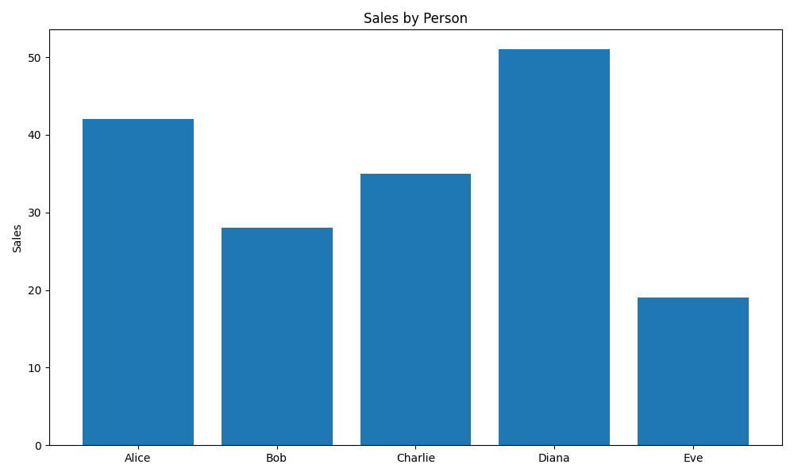

# Chartroom Demo

*2026-02-14T16:00:04Z*

Chartroom is a CLI tool for creating charts from data files (CSV, TSV, JSON, JSONL) or SQLite queries. Here are examples of each chart type it supports.

## Bar Chart

Bar charts display categorical data with rectangular bars. Supports grouped bars for multiple series.

```bash {image}
echo 'name,value
Alice,42
Bob,28
Charlie,35
Diana,51
Eve,19' | uv run chartroom bar --csv --title 'Sales by Person' --ylabel 'Sales'
```


