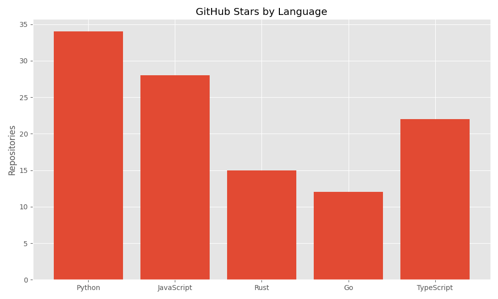
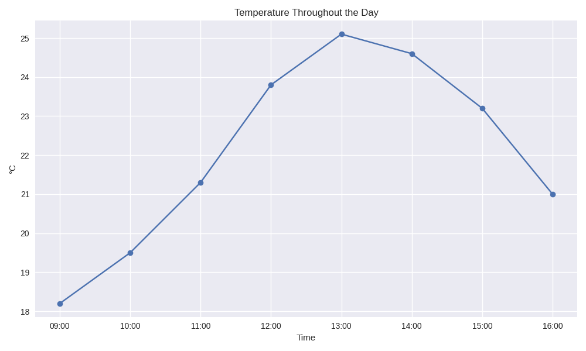
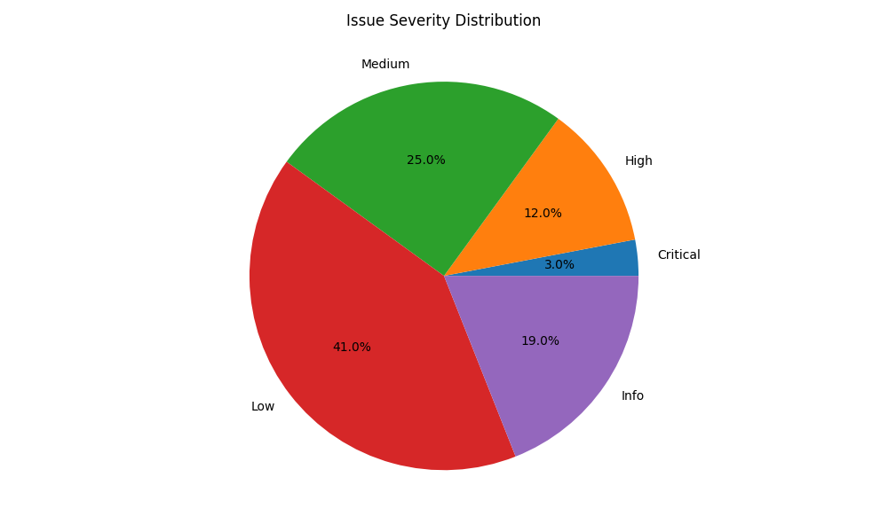
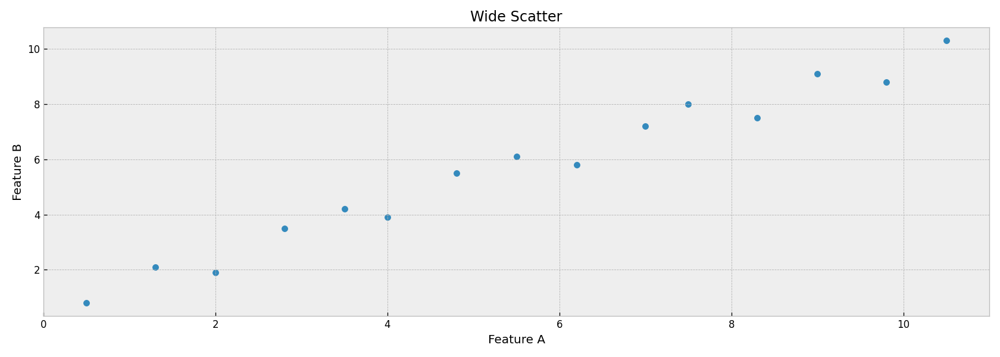
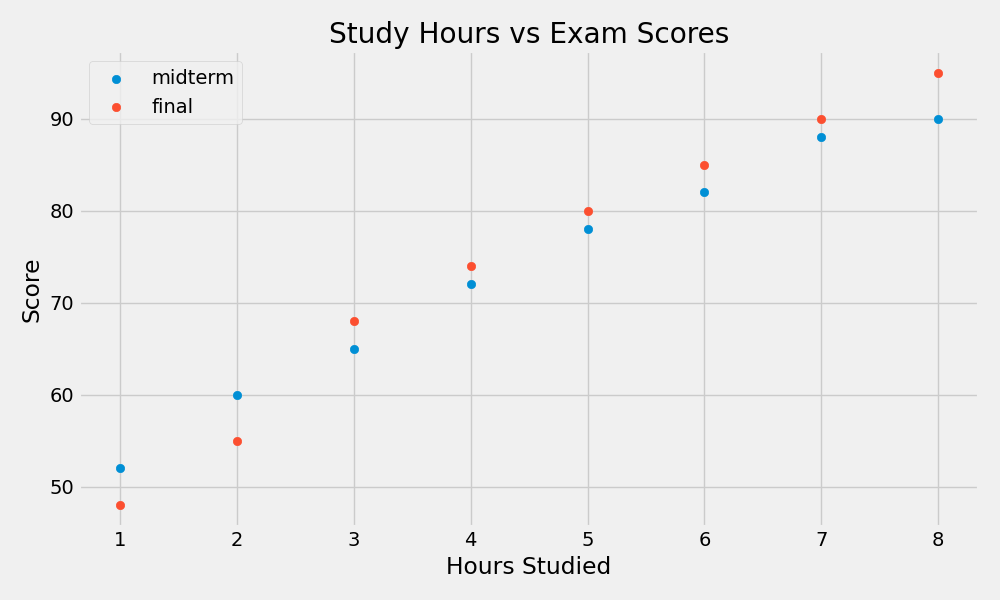

# Chartroom Demo

*2026-02-14T16:00:04Z*

Chartroom is a CLI tool for creating charts from data files (CSV, TSV, JSON, JSONL) or SQLite queries. Here are examples of each chart type it supports.

## Bar Chart

Bar charts display categorical data with rectangular bars. Supports grouped bars for multiple series.

```bash {image}
echo 'name,value
Alice,42
Bob,28
Charlie,35
Diana,51
Eve,19' | uv run chartroom bar --csv --title 'Sales by Person' --ylabel 'Sales'
```


## Line Chart

Line charts show trends over time or sequential data. Multiple series are overlaid with a legend.

```bash {image}
echo 'month,revenue,costs
Jan,100,80
Feb,120,90
Mar,115,85
Apr,140,95
May,160,100
Jun,155,110' | uv run chartroom line --csv -x month -y revenue -y costs --title 'Revenue vs Costs' --ylabel 'USD (thousands)'
```


## Scatter Plot

Scatter plots show the relationship between two numeric variables. Columns named 'x' and 'y' are auto-detected.

```bash {image}
echo 'x,y
1.2,2.4
2.5,4.1
3.1,3.8
4.7,6.2
5.3,5.9
6.0,7.8
7.2,8.1
8.5,9.3
9.1,10.2
10.0,11.5' | uv run chartroom scatter --csv --title 'Correlation Example' --xlabel 'X Values' --ylabel 'Y Values'
```


## Pie Chart

Pie charts show proportional data. Labels and values are auto-detected from 'name'/'label' and 'value'/'count' columns.

```bash {image}
echo 'name,value
Rent,1200
Food,400
Transport,200
Entertainment,150
Savings,300
Other,100' | uv run chartroom pie --csv --title 'Monthly Budget Breakdown'
```


## Histogram

Histograms show the distribution of a single numeric variable. Use --bins to control the number of bins.

```bash {image}
echo 'score
72
85
91
78
88
95
67
82
90
76
89
93
71
84
87
92
79
86
94
81' | uv run chartroom histogram --csv -y score --bins 8 --title 'Test Score Distribution' --xlabel 'Score' --ylabel 'Frequency'
```


## Input Formats

### JSON input

Chartroom accepts JSON arrays of objects. Here we pipe JSON directly and let the tool auto-detect column names.

```bash {image}
echo '[
  {"language": "Python", "count": 34},
  {"language": "JavaScript", "count": 28},
  {"language": "Rust", "count": 15},
  {"language": "Go", "count": 12},
  {"language": "TypeScript", "count": 22}
]' | uv run chartroom bar --json -x language -y count --title "GitHub Stars by Language" --ylabel "Repositories" --style ggplot
```



### JSONL (newline-delimited JSON)

Each line is a separate JSON object — useful for streaming or log-style data.

```bash {image}
printf '{"ts":"09:00","temp":18.2}\n{"ts":"10:00","temp":19.5}\n{"ts":"11:00","temp":21.3}\n{"ts":"12:00","temp":23.8}\n{"ts":"13:00","temp":25.1}\n{"ts":"14:00","temp":24.6}\n{"ts":"15:00","temp":23.2}\n{"ts":"16:00","temp":21.0}\n' | uv run chartroom line --jsonl -x ts -y temp --title "Temperature Throughout the Day" --xlabel "Time" --ylabel "°C" --style seaborn-v0_8
```



### TSV input

Tab-separated values, common in bioinformatics and spreadsheet exports.

```bash {image}
cat /tmp/issues.tsv | uv run chartroom pie --tsv --title 'Issue Severity Distribution'
```



### SQLite queries

Use --sql to query a SQLite database directly. The query runs in read-only mode.

```bash {image}
python3 -c "
import sqlite3
conn = sqlite3.connect(\"/tmp/demo.db\")
conn.execute(\"DROP TABLE IF EXISTS sales\")
conn.execute(\"CREATE TABLE sales (region TEXT, q1 INTEGER, q2 INTEGER, q3 INTEGER)\")
conn.executemany(\"INSERT INTO sales VALUES (?,?,?,?)\", [
    (\"North\", 120, 145, 160),
    (\"South\", 95, 110, 130),
    (\"East\", 140, 135, 155),
    (\"West\", 110, 125, 140),
])
conn.commit()
conn.close()
" && uv run chartroom bar --sql /tmp/demo.db "SELECT region, q1, q2, q3 FROM sales" -x region -y q1 -y q2 -y q3 --title "Quarterly Sales by Region" --ylabel "Revenue (k)" --style dark_background
```


## Styling Options

### Auto-detected format with custom sizing

When no format flag is given, chartroom peeks at the data to determine CSV vs TSV vs JSON. Combined here with custom figure dimensions.

```bash {image}
echo "x,y
0.5,0.8
1.3,2.1
2.0,1.9
2.8,3.5
3.5,4.2
4.0,3.9
4.8,5.5
5.5,6.1
6.2,5.8
7.0,7.2
7.5,8.0
8.3,7.5
9.0,9.1
9.8,8.8
10.5,10.3" | uv run chartroom scatter --title "Wide Scatter" --xlabel "Feature A" --ylabel "Feature B" --width 14 --height 5 --dpi 120 --style bmh
```



### Multiple series scatter with fivethirtyeight style

The fivethirtyeight style gives charts a clean, modern look popular in data journalism.

```bash {image}
echo '[
  {"hours": 1, "midterm": 52, "final": 48},
  {"hours": 2, "midterm": 60, "final": 55},
  {"hours": 3, "midterm": 65, "final": 68},
  {"hours": 4, "midterm": 72, "final": 74},
  {"hours": 5, "midterm": 78, "final": 80},
  {"hours": 6, "midterm": 82, "final": 85},
  {"hours": 7, "midterm": 88, "final": 90},
  {"hours": 8, "midterm": 90, "final": 95}
]' | uv run chartroom scatter --json -x hours -y midterm -y final --title "Study Hours vs Exam Scores" --xlabel "Hours Studied" --ylabel "Score" --style fivethirtyeight
```


