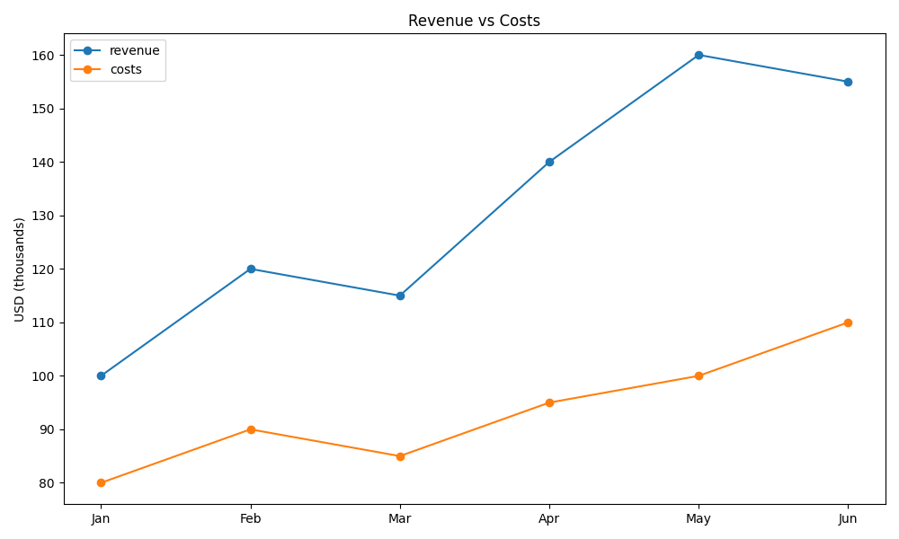
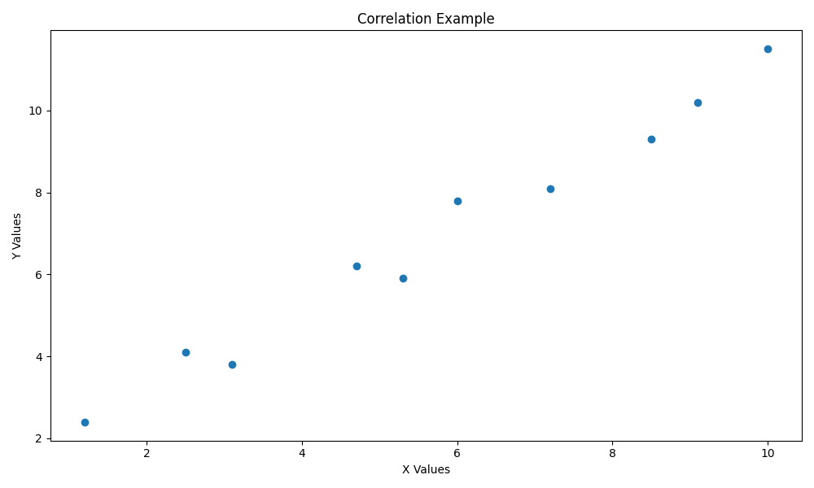
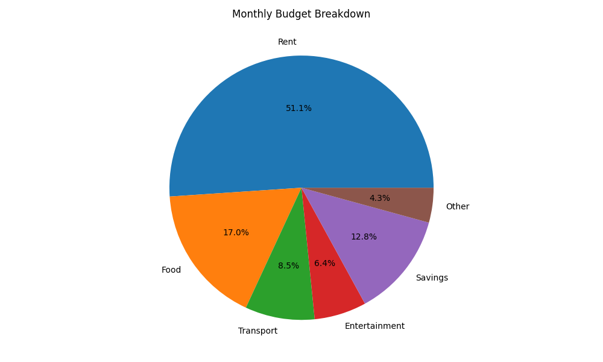
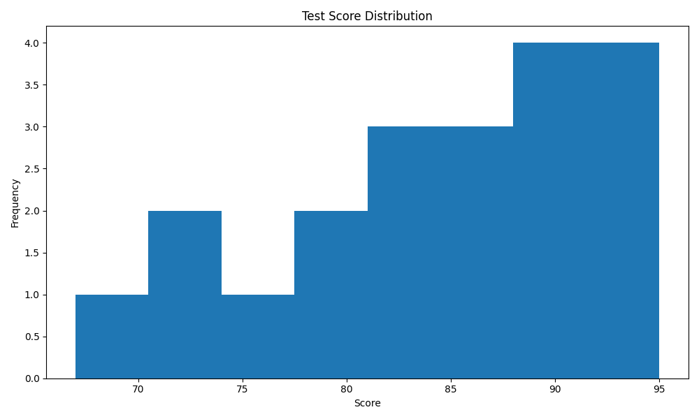

# Chartroom Demo

*2026-02-14T16:00:04Z*

Chartroom is a CLI tool for creating charts from data files (CSV, TSV, JSON, JSONL) or SQLite queries. Here are examples of each chart type it supports.

## Bar Chart

Bar charts display categorical data with rectangular bars. Supports grouped bars for multiple series.

```bash {image}
echo 'name,value
Alice,42
Bob,28
Charlie,35
Diana,51
Eve,19' | uv run chartroom bar --csv --title 'Sales by Person' --ylabel 'Sales'
```


## Line Chart

Line charts show trends over time or sequential data. Multiple series are overlaid with a legend.

```bash {image}
echo 'month,revenue,costs
Jan,100,80
Feb,120,90
Mar,115,85
Apr,140,95
May,160,100
Jun,155,110' | uv run chartroom line --csv -x month -y revenue -y costs --title 'Revenue vs Costs' --ylabel 'USD (thousands)'
```



## Scatter Plot

Scatter plots show the relationship between two numeric variables. Columns named 'x' and 'y' are auto-detected.

```bash {image}
echo 'x,y
1.2,2.4
2.5,4.1
3.1,3.8
4.7,6.2
5.3,5.9
6.0,7.8
7.2,8.1
8.5,9.3
9.1,10.2
10.0,11.5' | uv run chartroom scatter --csv --title 'Correlation Example' --xlabel 'X Values' --ylabel 'Y Values'
```



## Pie Chart

Pie charts show proportional data. Labels and values are auto-detected from 'name'/'label' and 'value'/'count' columns.

```bash {image}
echo 'name,value
Rent,1200
Food,400
Transport,200
Entertainment,150
Savings,300
Other,100' | uv run chartroom pie --csv --title 'Monthly Budget Breakdown'
```



## Histogram

Histograms show the distribution of a single numeric variable. Use --bins to control the number of bins.

```bash {image}
echo 'score
72
85
91
78
88
95
67
82
90
76
89
93
71
84
87
92
79
86
94
81' | uv run chartroom histogram --csv -y score --bins 8 --title 'Test Score Distribution' --xlabel 'Score' --ylabel 'Frequency'
```


