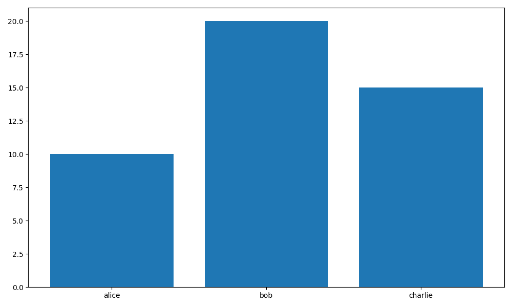
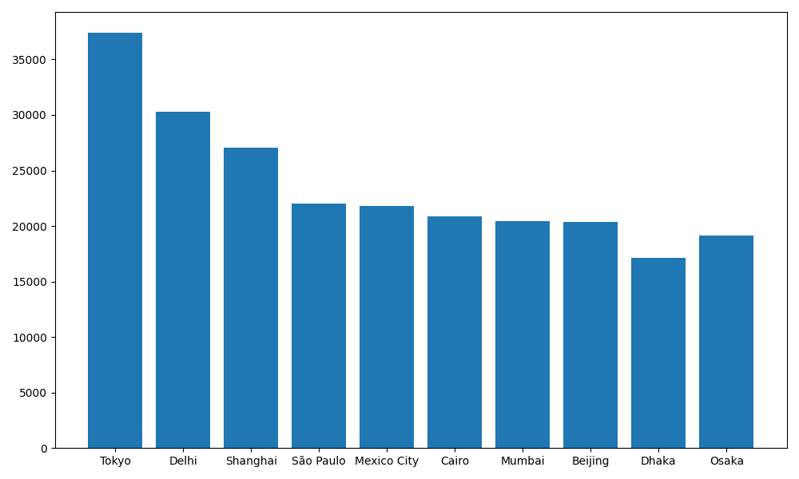
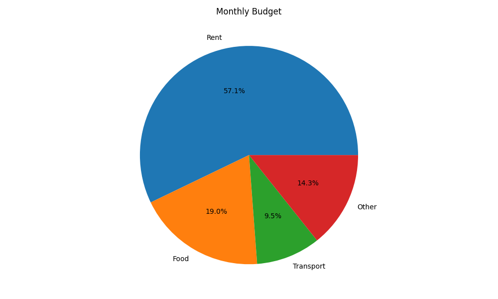
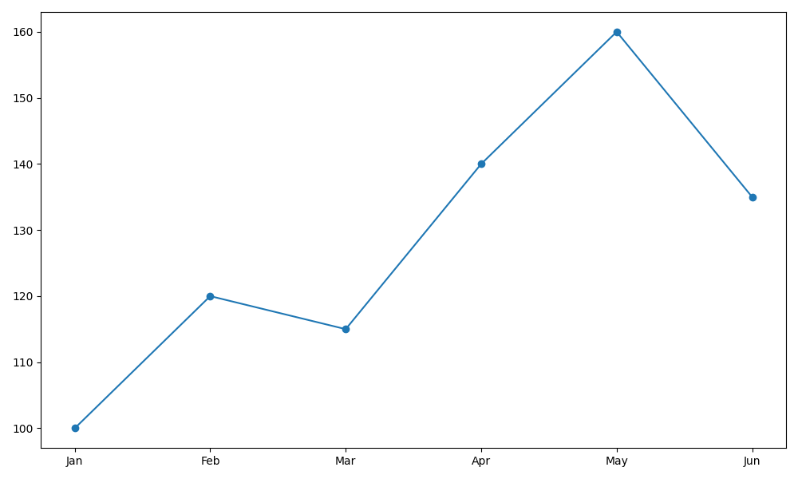
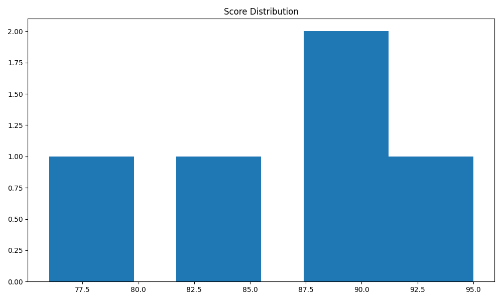

# Output Formats and Alt Text

*2026-02-14T16:48:05Z*

This demo shows chartroom's `-f` / `--output-format` option and its smart auto-generated alt text. Each section generates a chart and then shows the alt text that would be embedded in markdown, HTML, or JSON output.

## Bar Chart — Small Dataset

With a small dataset, the alt text lists every value:

```bash {image}
echo "name,value
alice,10
bob,20
charlie,15" > /tmp/small.csv && uv run chartroom bar --csv /tmp/small.csv -o demo/bar-small.png
```



```bash
uv run chartroom bar --csv /tmp/small.csv -o /tmp/x.png -f alt
```

```output
Bar chart of value by name — alice: 10, bob: 20, charlie: 15
```

## Bar Chart — Large Dataset

With more data points, the alt text summarizes the range:

```bash {image}
python3 -c "
import csv, sys
w = csv.writer(sys.stdout)
w.writerow([\"city\",\"population\"])
for c,p in [(\"Tokyo\",37400),(\"Delhi\",30290),(\"Shanghai\",27058),(\"São Paulo\",22043),(\"Mexico City\",21782),(\"Cairo\",20901),(\"Mumbai\",20411),(\"Beijing\",20384),(\"Dhaka\",17118),(\"Osaka\",19165)]:
    w.writerow([c,p])
" > /tmp/cities.csv && uv run chartroom bar --csv /tmp/cities.csv -x city -y population -o demo/bar-cities.png
```



```bash
uv run chartroom bar --csv /tmp/cities.csv -x city -y population -o /tmp/x.png -f alt
```

```output
Bar chart of population by city. 10 points, ranging from 17118 (Dhaka) to 37400 (Tokyo)
```

## Pie Chart

Pie chart alt text shows percentage breakdowns:

```bash {image}
echo "name,value
Rent,1200
Food,400
Transport,200
Other,300" > /tmp/budget.csv && uv run chartroom pie --csv /tmp/budget.csv -o demo/pie-budget.png --title "Monthly Budget"
```



```bash
uv run chartroom pie --csv /tmp/budget.csv -o /tmp/x.png -f alt --title "Monthly Budget"
```

```output
Monthly Budget. Pie chart showing Rent (57%), Food (19%), Transport (10%), Other (14%)
```

## Line Chart

```bash {image}
echo "month,revenue
Jan,100
Feb,120
Mar,115
Apr,140
May,160
Jun,135" > /tmp/revenue.csv && uv run chartroom line --csv /tmp/revenue.csv -o demo/line-revenue.png
```



```bash
uv run chartroom line --csv /tmp/revenue.csv -o /tmp/x.png -f alt
```

```output
Line chart of revenue by month — Jan: 100, Feb: 120, Mar: 115, Apr: 140, May: 160, Jun: 135
```

## Histogram

Histogram alt text describes the distribution range:

```bash {image}
echo "score
85
90
78
92
88
76
95
82
89
91" > /tmp/scores.csv && uv run chartroom histogram --csv -y score /tmp/scores.csv -o demo/hist-scores.png --title "Score Distribution"
```



```bash
uv run chartroom histogram --csv -y score /tmp/scores.csv -o /tmp/x.png -f alt --title "Score Distribution"
```

```output
Score Distribution. Histogram of 10 score values ranging from 76 to 95
```

## Markdown Output Format

Using `-f markdown` embeds the alt text directly in markdown image syntax:

```bash
uv run chartroom bar --csv /tmp/small.csv -o /tmp/x.png -f markdown
```

```output

```

## Title + Alt Text

When `--title` is set, it is prepended to the generated description so screen readers get both the human label and the data summary:

```bash
uv run chartroom bar --csv /tmp/small.csv -o /tmp/x.png -f alt --title "Team Scores"
```

```output
Team Scores. Bar chart of value by name — alice: 10, bob: 20, charlie: 15
```

Without `--title`, the description stands alone:

```bash
uv run chartroom bar --csv /tmp/small.csv -o /tmp/x.png -f alt
```

```output
Bar chart of value by name — alice: 10, bob: 20, charlie: 15
```

## Custom Alt Text

You can override the auto-generated alt text with `--alt`:

```bash
uv run chartroom pie --csv /tmp/budget.csv -o /tmp/x.png -f markdown --alt "How I spend my money each month"
```

```output

```

## JSON Output Format

The `-f json` format includes both path and alt text:

```bash
uv run chartroom line --csv /tmp/revenue.csv -o /tmp/x.png -f json | python3 -m json.tool
```

```output
{
    "path": "/tmp/x.png",
    "alt": "Line chart of revenue by month \u2014 Jan: 100, Feb: 120, Mar: 115, Apr: 140, May: 160, Jun: 135"
}
```
