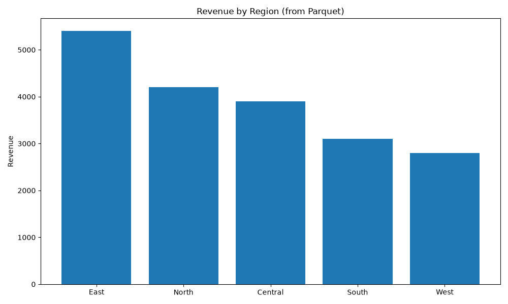
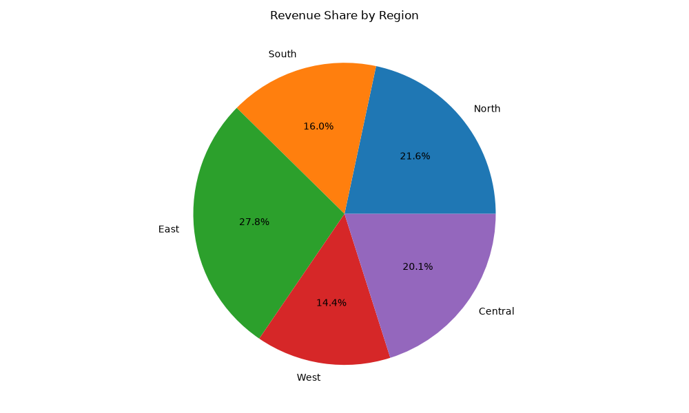
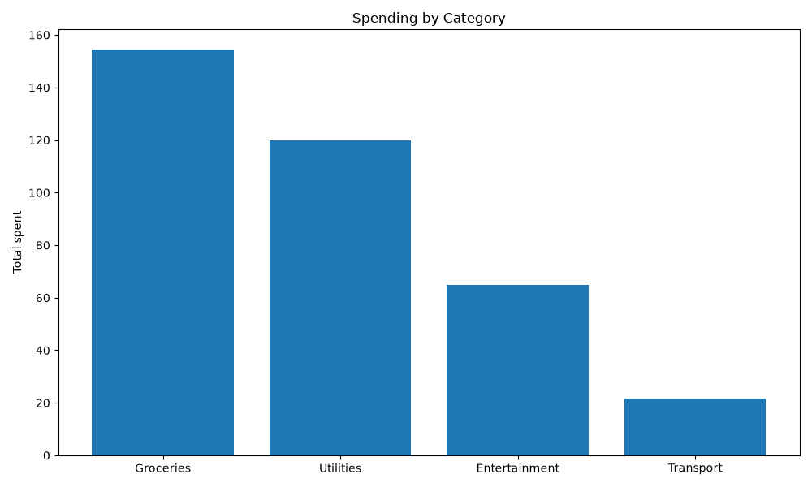

# Chartroom DuckDB Support

*2026-06-13T12:11:59Z by Showboat 0.6.1*
<!-- showboat-id: 86dc5bab-d647-446b-b606-23fa448c4f64 -->

Chartroom can read data from DuckDB. The `--duckdb DATABASE QUERY` option works against a persisted `.duckdb` file (opened read-only) or against `:memory:` — an in-memory database that lets DuckDB query data files directly off local disk or S3 (CSV, Parquet, JSON, and more).

First, let's create some sample data: a Parquet file and a persisted DuckDB database, both built from the same regional sales figures.

```bash
uv run python - <<'PY'
import duckdb
con = duckdb.connect()
con.execute("""
    CREATE TABLE sales AS SELECT * FROM (VALUES
        ('North', 4200),
        ('South', 3100),
        ('East', 5400),
        ('West', 2800),
        ('Central', 3900)
    ) AS t(region, revenue)
""")
# Write a Parquet file queried later via the in-memory database
con.execute("COPY sales TO 'demo/sales.parquet' (FORMAT parquet)")
# Write a persisted DuckDB database file
con.execute("ATTACH 'demo/sales.duckdb' AS persisted")
con.execute("CREATE OR REPLACE TABLE persisted.sales AS SELECT * FROM sales")
con.close()
print('Created demo/sales.parquet and demo/sales.duckdb')
PY
```

```output
Created demo/sales.parquet and demo/sales.duckdb
```

### In-memory database querying a Parquet file

Using `:memory:`, DuckDB reads the Parquet file straight off disk — no database to load first. This same pattern works against `s3://` URLs once DuckDB's httpfs extension is configured.

```bash
uv run chartroom bar --duckdb :memory: "SELECT region AS name, revenue AS value FROM 'demo/sales.parquet' ORDER BY value DESC" --title 'Revenue by Region (from Parquet)' --ylabel 'Revenue' -o /tmp/cr_parquet.png
```

```output
/tmp/cr_parquet.png
```

```bash {image}

```



### Querying a persisted DuckDB file

Point `--duckdb` at a `.duckdb` file to query its tables. The file is opened **read-only**, so a chart can never modify your database.

```bash
uv run chartroom pie --duckdb demo/sales.duckdb "SELECT region AS name, revenue AS value FROM sales" --title 'Revenue Share by Region' -o /tmp/cr_file.png
```

```output
/tmp/cr_file.png
```

```bash {image}

```



### Aggregating a CSV on the fly

Because the query runs in DuckDB, you can do real SQL work — `GROUP BY`, `SUM`, joins — over a raw file before charting. Here we total spending per category straight from a CSV:

```bash
uv run chartroom bar --duckdb :memory: "SELECT category AS name, SUM(amount) AS value FROM read_csv('demo/transactions.csv') GROUP BY category ORDER BY value DESC" --title 'Spending by Category' --ylabel 'Total spent' -o /tmp/cr_csv.png
```

```output
/tmp/cr_csv.png
```

```bash {image}

```



### Reading from S3

The same in-memory approach reads remote files once DuckDB's `httpfs` extension and credentials are configured — just point the query at an `s3://` URL:

```bash
chartroom bar --duckdb :memory: \
  "SELECT region AS name, revenue AS value FROM 's3://my-bucket/sales.parquet'"
```
