# Chartroom Style Gallery

*2026-02-14T19:54:34Z by Showboat 0.5.0*

Each image below shows the same five chart types — bar, line, scatter, pie, and histogram — rendered using a different matplotlib style. Use `--style NAME` with any chartroom command to apply a style.

### Solarize_Light2

```bash {image}

```

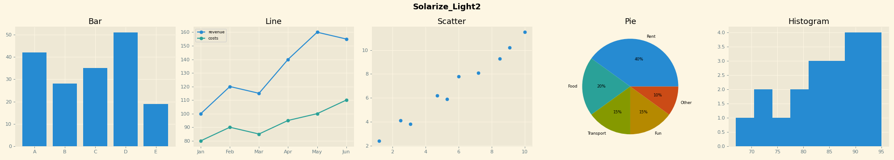

### bmh

```bash {image}

```

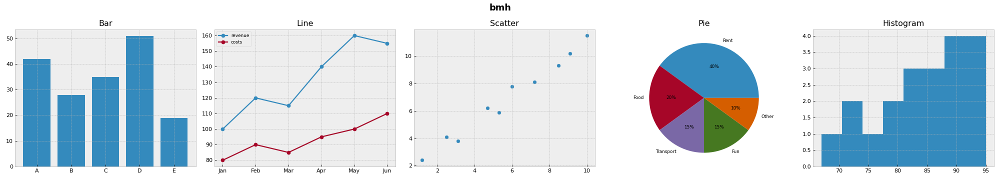

### classic

```bash {image}

```

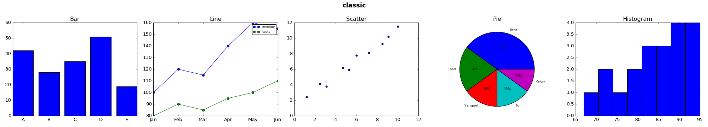

### dark_background

```bash {image}

```

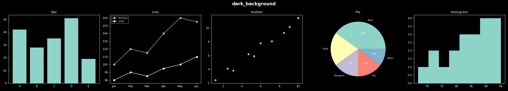

### fast

```bash {image}

```

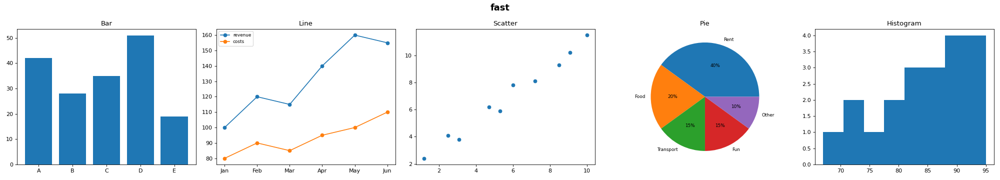

### fivethirtyeight

```bash {image}

```

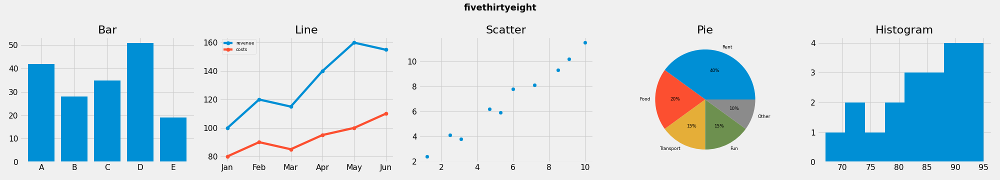

### ggplot

```bash {image}

```

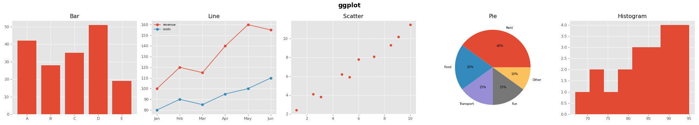

### grayscale

```bash {image}

```

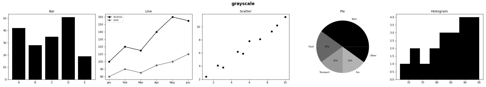

### petroff10

```bash {image}

```

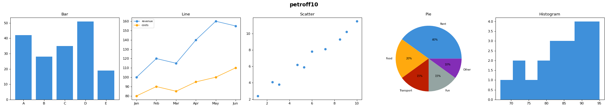

### seaborn-v0_8

```bash {image}

```

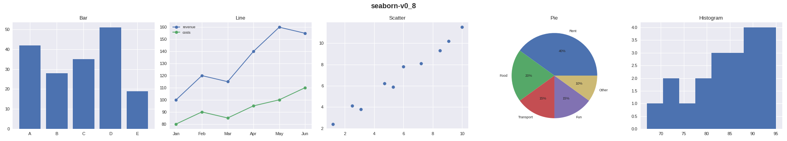

### seaborn-v0_8-bright

```bash {image}

```

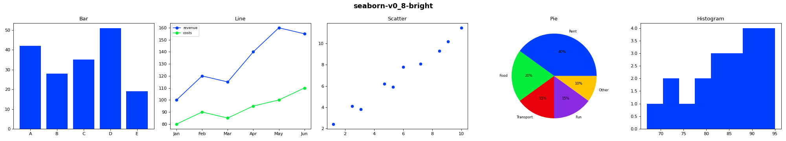

### seaborn-v0_8-colorblind

```bash {image}

```

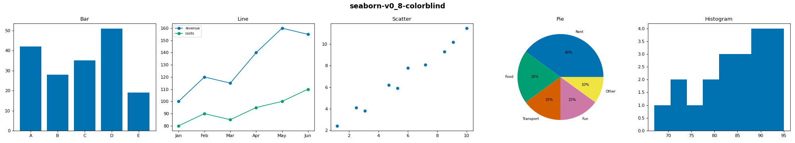

### seaborn-v0_8-dark

```bash {image}

```

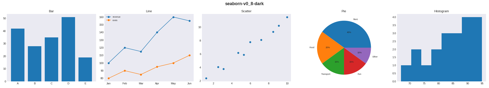

### seaborn-v0_8-dark-palette

```bash {image}

```

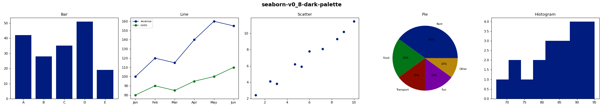

### seaborn-v0_8-darkgrid

```bash {image}

```


### seaborn-v0_8-deep

```bash {image}

```


### seaborn-v0_8-muted

```bash {image}

```

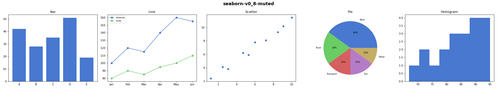

### seaborn-v0_8-notebook

```bash {image}

```


### seaborn-v0_8-paper

```bash {image}

```

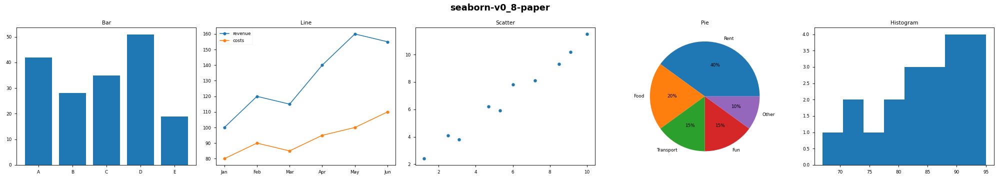

### seaborn-v0_8-pastel

```bash {image}

```

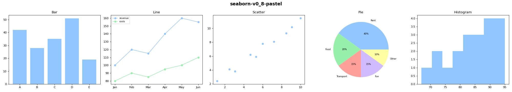

### seaborn-v0_8-poster

```bash {image}

```

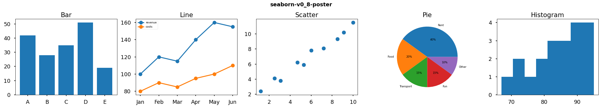

### seaborn-v0_8-talk

```bash {image}

```

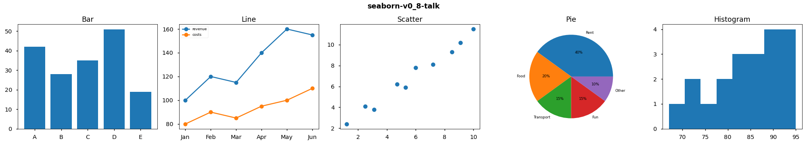

### seaborn-v0_8-ticks

```bash {image}

```


### seaborn-v0_8-white

```bash {image}

```


### seaborn-v0_8-whitegrid

```bash {image}

```

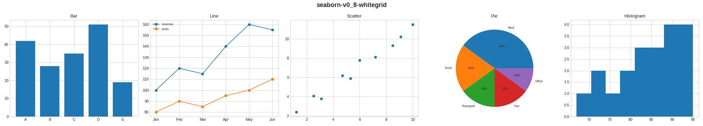

### tableau-colorblind10

```bash {image}

```

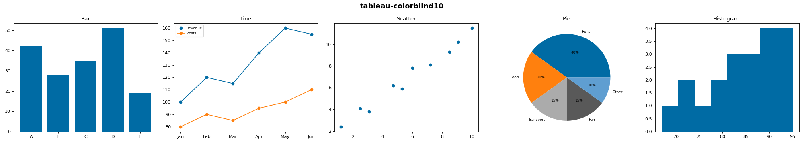
